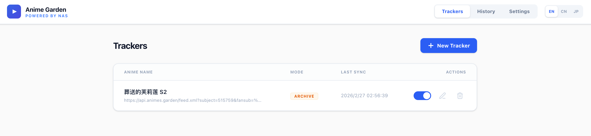
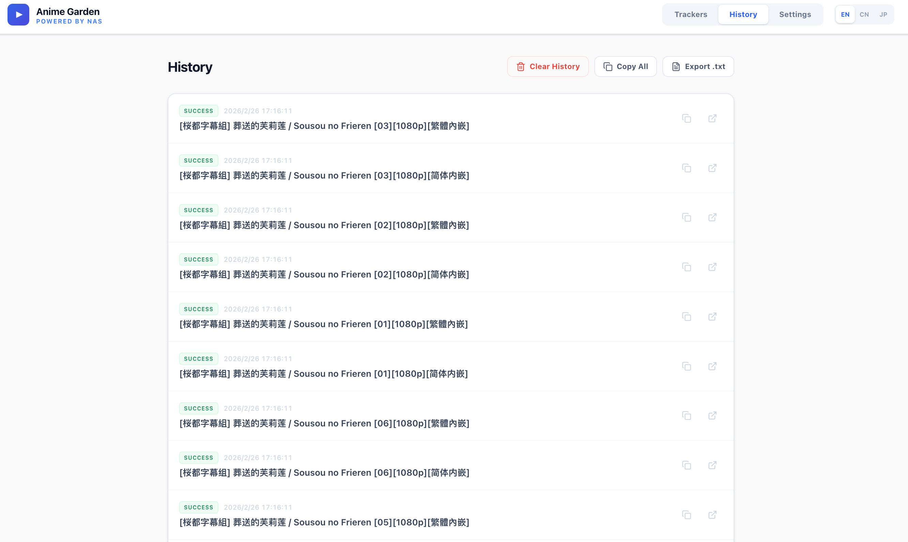
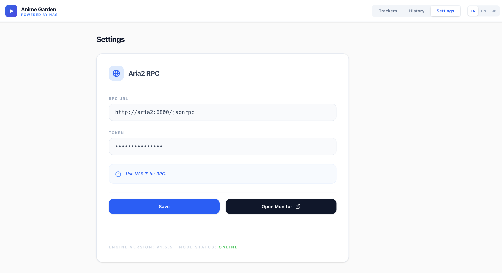

# 动漫花园RSS订阅工具 - 桌面版 (Anime Garden RSS Desktop)

基于 **Tauri (Rust + React)** 构建的独立桌面下载管理工具。

## 核心特性 (v1.5.0+)

- **📦 内置 Aria2 下载器**：无需手动安装任何下载器，App 启动即自动运行私有下载核心。
- **📁 灵活路径管理**：原生支持在设置中选择下载保存目录。
- **⚡ 多线程优化**：支持自定义最大并发线程数，压榨网络带宽。
- **🎨 极简现代 UI**：Apple 风格的清新排版，支持中/英/日多语言。
- **🦀 Rust 驱动**：高性能 RSS 抓取与解析引擎。

## 界面预览





## 开发者说明：内置二进制 (Sidecar)

为了使应用完全独立运行，你需要在打包前将对应平台的 `aria2c` 二进制文件放置在 `src-tauri/binaries/` 目录下，并按照 Tauri 的规范命名：

- **macOS (ARM)**: `aria2c-aarch64-apple-darwin`
- **macOS (Intel)**: `aria2c-x86_64-apple-darwin`
- **Windows**: `aria2c-x86_64-pc-windows-msvc.exe`

## 开发与构建

### 前提条件

- [Rust](https://www.rust-lang.org/learn/get-started#installing-rust) 环境
- [Node.js](https://nodejs.org/) & [pnpm](https://pnpm.io/)

### 安装与运行

```bash
pnpm install
pnpm tauri dev
```

### 构建正式版 (macOS ARM)

```bash
pnpm tauri build --target aarch64-apple-darwin
```

## 开源协议

MIT
